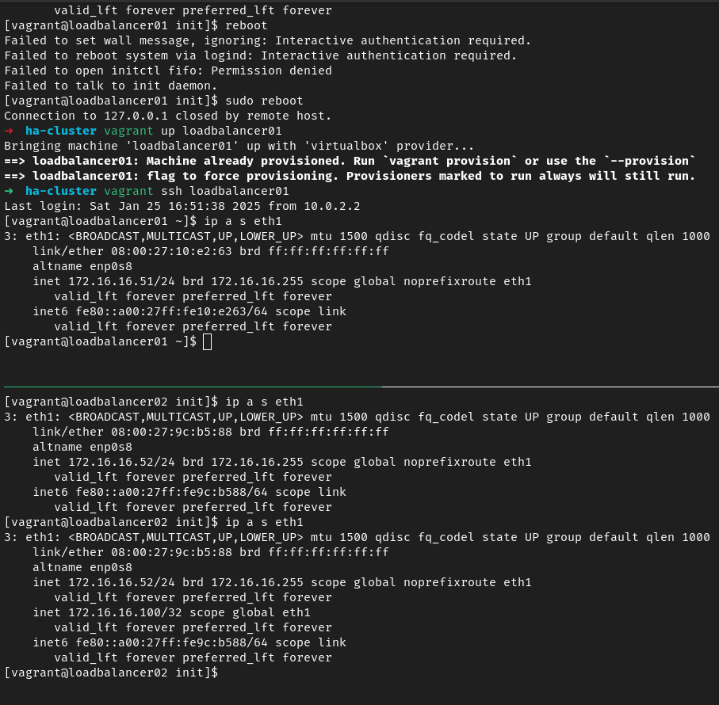

# High Availability Kubernetes Cluster

### Index
1. [Overview](#index)
2. [VMs Setup](#vms-setup)
3. [setup Loadbalancers](#setup-loadbalancers)
4. [Common Nodes Setup](#common-nodes-setup)
5. [Bootstrap the Cluster](#bootstrap-the-cluster)
6. [Testing The Cluster](#testing-the-cluster)
7. [Activate MetalLB](#activate-metallb)
8. [Deploying An Application](#deploying-an-application)
9. [Deploy PostgreSQL with Patroni](#deploy-postgresql-with-patroni)
10. [Reference](#reference)


### Overview
This project showcase a high available Kubernetes (k8s) cluster with the following architecture:

<p align="center">

</p>

> The purpose of this design is to achieve redundancy and proper failover in case of a node(s) failure, to achieve a high availability setup.


### VMs Setup
First, install `vagrant`, for this project the following version's used `v2.4.3`, and `virtualbox`, `v7.1.6`, on a linux-based host machine. i.e. arch in this case, so the commands are:

```shell
# Vagrant
yay -S vagrant

# VirtualBox
yay -S virtualbox
```

then specify a dedicated folder for the cluster setup, and initialized the `Vagrantfile` using:

```shell
vagrant init
```

then open `Vagranfile` and setup the required VMs. For this project, there are a total of 7 VMs to provision the required nodes in the following specs:

|      Node      |      IP       |   RAM   | CPU |
|:--------------:|:-------------:|:-------:|:---:|
| loadbalancer01 | 176.16.16.51  | 512 MB  |  1  |
| loadbalancer02 | 176.16.16.52  | 512 MB  |  1  |
| kmaster01      | 176.16.16.101 | 2048 MB |  2  |
| kmaster02      | 176.16.16.102 | 2048 MB |  2  |
| kmaster03      | 176.16.16.103 | 2048 MB |  2  |
| kworker01      | 176.16.16.201 | 2048 MB |  2  |
| kworker02      | 176.16.16.202 | 2048 MB |  2  |
| Virtual IP     | 176.16.16.100 |    -    |  -  |

* Notes:
  - For `masters` & `workers` nodes, a minimum of 2 GB is required for `kubeadm` to work propely
  - The Virtual IP is managed by `KeepAlived` on loadbalancer nodes (Check [Setup Loadbalancers](#setup-loadbalancers)).

In `Vagrantfile`, use the following template for provisioning each node:
```ruby
  NodesCount = 2 # Update to required number of nodes
  (1..NodesCount).each do |i|

    node_name = "node0#{i}" # Update to required node name

    # VM config
    config.vm.define node_name do |lb|

      lb.vm.box               = "almalinux/8"
      lb.vm.box_check_update  = false # Disable update check
      lb.vm.hostname          = node_name

      # Assign the required IP to the node
      lb.vm.network "private_network", ip: "172.16.16.1#{i}" # Update to required IP

      # Specify virtual machine provider as virtualbox
      lb.vm.provider :virtualbox do |v|
        v.name    = node_name
        v.memory  = 1024 # Update to required RAM
        v.cpus    = 2    # Update to required CPU count
      end
    end
  end
```
The complete `Vagrantfile` for this project is provided in this repo.

Once the file is setup to provision the required VMs (a.k.a nodes), use the following command to start them up:

```shell
vagrant up
```

It'll take time to provision all nodes for the first time to be up and running.


### Setup Loadbalancers
This section will show the setup of both loadbalancer nodes.

> The purpose of setting up loadbalancers is to ensure load distribution and failover.

Let's install `HAproxy` and `KeepAlived`:
```shell
# HAProxy
sudo dnf install haproxy

# KeepAlived
sudo dnf install keepalived
```

`HAProxy` is a loadbalancer that is responsible for distributing incoming traffic to speicified nodes in balanced manners[^1], while `KeepAlived` insure a failover and re-prioritization between redundant nodes.


For `HAProxy`, update its haproxy.cfg in `/etc/haproxy/haproxy.cfg` with the following configuration:
```shell
frontend kubernetes-frontend
  bind *:6443   # Listen to the default k8s API port
  mode tcp      # Layer 4 loadbalancing
  option tcplog # Log tcp connection details
  default_backend kubernetes-backend  # Route traffic to the specified backend

backend kubernetes-backend
  mode tcp           # Uses tcp mode
  option tcp-check   # Enable TCP health checks
  balance roundrobin # Distribute traffic sequentially
    # Specify the master nodes' IPs with health checks
    # fall 3 means mark server as down after 3 consecutive failed checks
    # rise 2 means mark server as up after 2 consecutive sucessful checks
    server kmaster1 172.16.16.101:6443 check fall 3 rise 2
    server kmaster2 172.16.16.102:6443 check fall 3 rise 2
    server kmaster3 172.16.16.103:6443 check fall 3 rise 2
```

Then apply the configuration to the `HAProxy` service:
```shell
# if the service's not active
sudo systemctl enable haproxy && sudo systemctl start haproxy

# if it's active
sudo systemctl restart haproxy
```

For `KeepAlived`, create the following health checking shell script, check_apiserver.sh, in `/etc/keepalived/check_apiserver.sh`:
```shell
#!/bin/sh

# error print then exit
errorExit() {
  echo "*** $@" 1>&2 # prints the error message to stderr
  exit 1 # exit with status code 1 (failure)
}

# To check if the locl k8s API is reachable
curl --silent --max-time 2 --insecure https://localhost:6443/ -o /dev/null || errorExit "Error GET https://localhost:6443/"

# The same k8s API check but happens only if the LB node obtains the Virtual IP
if ip addr | grep -q 172.16.16.100; then
  curl --silent --max-time 2 --insecure https://172.16.16.100:6443/ -o /dev/null || errorExit "Error GET https://172.16.16.100:6443/"
fi
```

Then change the permission of the script to ensure it's executable:
```shell
sudo chmod +x /etc/keepalived/check_apiserver.sh
```

Then create a keepalived.conf, for managing the Virtual IP and performing health checks, in `/etc/keepalived/keepalived.conf`:
```ruby
vrrp_script check_apiserver {
  script "/etc/keepalived/check_apiserver.sh" # the health checking script
  interval 3 # run every 3 seconds
  timeout 10 # to check if script exceeds 10 seconds (indicates a failure)
  fall 5     # mark server as down after 5 consecutive failed checks
  rise 2     # mark server as up after 2 consecutive successful checks
  weight -2  # adjust priority value by subtracting 2 for failed checks
}

vrrp_instance VI_1 {
    state BACKUP           # Start in BACKUP state. All nodes start in this state by default to avoid master conflict, a.k.a split-brain
    interface eth1         # Use eth1 interface for VRRP (Virtual Redundancy Routing Protocol)[^2]
    virtual_router_id 1    # VRRP group ID
    priority 100           # initial priority value (the higher the value, the likely to become in MASTER state)
    advert_int 5           # VRRP advertisement interval every 5 secons
    authentication {       # VRRP authentication for peer communication
        auth_type PASS     # use PASSWORD-based authetication
        auth_pass mysecret # Password value (must be the same for all nodes)
    }
    virtual_ipaddress {    # Virtual IP (VIP)
        172.16.16.100      # The VIP Address floating between nodes
    track_script {         # Referencing the health checking scrript
        check_apiserver    # The health checking script for adjusting priority 
    }
}

Then apply the configuration to the `KeepAlived` service:
```shell
# if the service's not active
sudo systemctl enable keepalived && sudo systemctl start keepalived

# if it's active
sudo systemctl restart keepalived
```


### Common Nodes Setup 
The section will setup all nodes that has Kubernetes components (master & worker nodes).

- Disable swap:
```shell
sudo swapoff -a; sudo sed -i '/swap/d' /etc/fstab
```
> The reason for disabling swap is that `Kubelet` needs to enforce resouces limit (CPU & Memory) for pods. Keeping swap enabled will lead to unpredictable scheduling decision by the system. Additionlly it's way slower that RAM and keeping it enabled will lead to a degrade node performance.

- Disable Firwall:
```shell
sudo systemctl disable firwalld # or ufw
```
> The reason for disabling firewall is that Kubernetes components uses certain ports and firewall could block then, causing cluster failure. Another option is to configure firewall rules to allow k8s ports (benenficial in production).

- Enable Kernel modules, overlay & br_netfilter, for k8s by creating containerd.conf in `/etc/modules-load.d/containerd.conf` to be loaded on provision:
```shell
overlay
br_netfilter
```

then load them manually:
```shell
sudo modprobe overlay
sudo modprobe br_netfilter
```

> The purpose of enabling overlay and br_netfilter modules is that for `overlay`, it enables OverlayFS which is used by container runtimes (e.g. containerd, docker) to manage conatainer images' layers effeciently, and for mounting volumes as well. For `br_netfilter`, it enables bridged traffic to traverse iptables rules which is required by k8s networking and service routing.

- Enable Kernel settings for k8s Container Network Interface (CNI) by creating kubernetes.conf in `/etc/sysctl.d/kubernetes.conf` to be applied on provision:
```shell
# Bridged Network
net.bridge.bridge-nf-call-ip6tables = 1
net.bridge.bridge-nf-call-iptables  = 1
# IP forwarding
net.ipv4.ip_forward                 = 1
```
> The purpose of enabling the bridged network and IP forwarding is that for `bridged network` used by k8s CNI plugins (e.g. Calico, KubeProxy) are processed by iptables for traffic routing to k8s Services (CluserIP, NodePort), and pod-to-pod traffic rules enforcement. For `IP forwarding`, it allows nodes to act as routers and forward traffic between network interfaces to enable pod-to-pod communication, as well as forwarding traffic between nodes' external intefaces and pods' networks.

- Install container runtime `containerd`:
```shell
sudo dnf install containerd
mkdir /etc/containerd
containerd config default > /etc/containerd/config.toml
sudo systemctl enable containerd
sudo systemctl start containerd
```
> The reason for installing a container runtime, i.e. containerd, is that it's the core component in Kubernetes to run and manage containers and handling their lifecycles.

- Add kubernetes repo to install k8s main components by creating kubernetes.repo in `/etc/yum.repos.d/kubernetes.repo`:
```shell
[kubernetes]
name=Kubernetes
baseurl=https://pkgs.k8s.io/core:/stable:/v1.31/rpm/
enabled=1
gpgcheck=1
gpgkey=https://pkgs.k8s.io/core:/stable:/v1.31/rpm/repodata/repomd.xml.key
exclude=kubelet kubeadm kubectl cri-tools kubernetes-cni
```
> The purpose is to add the k8s repo url to install k8s main components in the next step

- Install Kubernetes components
```shell
sudo dnf update
sudo dnf install kubeadm kubelet kubectl
```
> The purpose of installing these component because they're main k8s componenet to initialize the spin k8s nodes. For `kubeadm`, it's used to initialized the master node, and to join other master and worker nodes. For `kubelet`, it's responsible for maintaining the state of pods on nodes. It ensures the containers within pods are running and in healthy state. It also interacts with k8s Apiserver to pass the status of containers and nodes, and receive instructions on what should be running. Additionallt it monitors the health of the node it runs on, and ensures the report of the node availability and resource usage. For `kubectl`, it's Command-Line Interface (CLI) used to interact with k8s cluster. It's used to manage cluster resources, applications' deployment and troubleshooting.


### Bootstrap the Cluster
In this section, the cluster will be bootstrapped by initializing a controlplane in one of the master node using kubeadm init. node kmaster01 is arbitrary chosen in this step
```shell
kubeadm init --control-plane-endpoint="172.16.16.100:6443" --upload-certs --apiserver-advertise-address=172.16.16.101 --pod-network-cidr=192.168.0.0/16
```
> The purpose of this command is to initialize a controlplane in one of the master nodes. In this argument `--control-plane-endpoint` A controlplane endpoint is specified by having the virtual IP because of high availability to acheive by floating between master nodes in case of a failure in one of them. In this argument `--upload-certs` TLS certificates are ensured to be stored in the cluster's etcd database for secure communications between controlplanes. In this argument `--apiserver-advertise-address` is required for advertising its actual IP to other nodes in the cluster because of the external IP different from the node IP, in this case it's the virtual IP, and the cluster is highly available (a.k.a multi-master nodes). In this argument `--pod-network-cidr` the CIDR block for pod IP addresses is defined, Kubernetes needs a range of IPs to assign to pods.

After the initilization complete, it'll produce two join commands, one to join other master nodes (controlplanes), and the other is to join worker nodes. Apply the master join command to the remaining master nodes and add the argument `--apiserver-advertise-address={master-ip}` and replace `{master-ip}` with the node IP. Then apply the worker join command to the worker nodes.

Next, deploy Calico network:
```shell
sudo kubectl --kubeconfig=/etc/kubernetes/admin.conf create -f https://docs.projectcalico.org/v3.18/manifests/calico.yaml
``` 
> The purpose of deploying Calico CNI is to provide networking capabilities for pod-to-pod communication accross nodes, and IP management. Also, it supports network policies and rules that allow for traffic control. Additionally Calico uses BGP (Border Gateway Protocol) for routing in large-scale cluster, which makes it highly scalable and efficient.

Finally, in the host machine, create a `~/.kube` folder. Inside it copy the kubernetes admin configration in one of the master nodes in `/etc/kubernetes/admin.conf` to `~/.kube/config`:
```shell
mkdir ~/.kube
scp vagrant@172.16.16.101:/etc/kubernetes/admin.conf ~/.kube/config
```

Once all steps are completed, a cohesive k8s cluster is now ready to use. It can be verified by executing:
```shell
kubectl get nodes
```

|
| :---: |
| Running Cluster |
Let's get to deploy a sample nginx application as well (Deployment file [available](./nginx/nginx-sample.yaml) in this project)
```shell
kubectl apply -f ./nginx/nginx-sample.yaml 
```

||
| :---: |
| Deployed Nginx Sample Pod  |


### Testing The Cluster
To test the high availability of the cluster, let's simulate a failure in one of the loadbalancers, by rebooting `loadbalancer01` to check the floating of Virtual IP to the other running LB and to see the priority value get updated

|  |  |  |
| :---: | :---: | :---: |
| Pre-failure: Loadbalancer 1 with Virtual IP & MASTER State | Post-failure: Loadbalancer 2 now with Virtual IP & MASTER State | Priority Value Change and State Re-assign

Now let's simulate a controlplane unavailability by rebooting one of the master nodes:
||
| :---: |
| Not Ready Controlplane |


### Activate MetalLB
MetalLB is a k8s-native loadbalancer that assigns external IPs to k8s services of type `LoadBalancer` to make service accesible outside the cluster.

First, let's edit the KubeProxy config as it's required by MetalLB documentation ([Docs](https://metallb.io/installation/index.html#preparation))
```shell
kubectl edit configmap -n kube-system kube-proxy
```
Then set `strictARP` to `true`

Now let's install MetalLB by applying its manifest:
```shell
kubectl apply -f https://raw.githubusercontent.com/metallb/metallb/v0.14.9/config/manifests/metallb-native.yaml
```

To verify MetalLB is installed, check its pods in `metallb-system` namespace:
```shell
kubectl get pods -n metallb-system
```

Next, let's create an `IPAddressPool` YAML file and specify an unused IP range that is part of the VMs subnet, e.g. 172.16.16.150-172.16.16.190:
```yaml
# ./metallb/metallb-pool.yaml
apiVersion: metallb.io/v1beta1
kind: IPAddressPool
metadata:
  name: first-pool
  namespace: metallb-system
spec:
  addresses:
  - 172.16.16.150-172.16.16.190
```

Then apply the file to `metallb-system` namespace:
```shell
kubectl -n metallb-system apply -f ./metallb/metallb-pool.yaml
```

Let's verify the IPAddressPool is created:
 ```shell
 kubectl -n metallb-system get IPAddressPool
 ```

||
| :---: |
| Created IPAddressPool |

Next, let's create a `L2Advertisement` YAML file to adertise the IP coming from the specified `IPAddressPool`:
```yaml
# ./metallb/metallb-l2-advertisement.yaml
apiVersion: metallb.io/v1beta1
kind: L2Advertisement
metadata:
  name: metallb-l2
  namespace: metallb-system
spec:
  ipAddressPools:
  - first-pool
```

Then apply the file to `metallb-system` namespace:
```shell
kubectl -n metallb-system apply -f ./metallb/metallb-l2-advertisement.yaml
```

Let's verify the L2Advertisement is created:
 ```shell
 kubectl -n metallb-system get L2Advertisement
 ```

||
| :---: |
| Created L2Advertisement |

Now assigning an external IP for k8s Services of type `Loadbalancer` is ready


### Deploying An Application
Let's deploy a sample application, in this example it's a private registry to store docker images instead of pulling from Docker Hub.

Let's pull the registry image
```shell
docker pull registry
``` 

Let's create a `StorageClass`:
```yaml
apiVersion: storage.k8s.io/v1
kind: StorageClass
metadata:
  name: registry-storage
provisioner: kubernetes.io/no-provisioner
volumeBindingMode: WaitForFirstConsumer
```

Now let's create a `PersistentVolume`:
```yaml
apiVersion: v1
kind: PersistentVolume
metadata:
  name: registry-pv
spec:
  capacity:
    storage: 1Gi
  volumeMode: Filesystem
  accessModes:
    - ReadWriteOnce
  persistentVolumeReclaimPolicy: Retain
  storageClassName: registry-storage
  local:
    path: /mnt/pv # or with ""
  nodeAffinity:
    required:
      nodeSelectorTerms:
      - matchExpressions:
        - key: kubernetes.io/hostname
          operator: In
          values:
          - kworker01
          - kworker02
```

Now create a `PersistentVolumeClaim`:
```yaml
apiVersion: v1
kind: PersistentVolumeClaim
metadata:
  name: registry-pvc
spec:
  storageClassName: registry-storage
  accessModes:
    - ReadWriteOnce
  resources:
    requests:
      storage: 1Gi
```

Now create a `Deployment`:
```yaml
apiVersion: apps/v1
kind: Deployment
metadata:
  name: registry
  labels:
    app: registry
spec:
  replicas: 1
  selector:
    matchLabels:
      app: registry
  template:
    metadata:
      labels:
        app: registry
    spec:
      volumes:
        - name: registry-storage
          persistentVolumeClaim:
            claimName: registry-pvc
      containers:
        - name: registry
          image: registry:2
          ports:
            - containerPort: 5000
          volumeMounts:
            - name: registry-storage
              mountPath: /data
```

Now with a service of type `Loadbalancer` to assign an external IP by MetalLB:
```yaml
apiVersion: v1
kind: Service
metadata:
  name: registry-service
spec:
  selector:
    app: registry
  ports:
    - protocol: TCP
      port: 5000
      targetPort: 5000
  type: LoadBalancer
```

Now it's possible to have a separate YAML file for each and apply them individually, or better combine them in one YAML file, for example [registry-k8s.yaml](./registry/registry-k8s.yaml), separated by a three dashes in a new line, i.e. `---` and apply it:
```shell
kubectl apply -f ./registry/registry-k8s.yaml
```

||
| :---: |
| Deployed registry with an External IP of 172.16.16.151:5000 |

One last step is to add the registry IP and port to docker daemon to interact with the registry by adding the following to `/etc/docker/daemon.json`:
```json
"insecure-registries": ["172.16.16.151:5000"]
```

Then restart containerd & docker
```shell
sudo systemctl restart containerd
sudo systemctl restart docker
```

Let's tag and push the nginx image that was pulled earlier in a previous section:

```shell
# First tag the image with the ip address and port of the regsitry
docker tag nginx 172.16.16.151:5000/nginx

# Then push the tagged image to private registry
docker push 172.16.16.151:5000/nginx
```

Now registry is reachable with the pushed nginx image:

||
| :---: |
| Reachable Registry |

### Deploy PostgreSQL with Patroni
Patroni is a high availability framework for PostgreSQL that automates failover, replication, and cluster management. When deploying PostgreSQL on k8s, Patroni solves challenges like leader election, automatic failover, and configuration consistency.

- Patroni Architecture in Kubernetes:

                      +------------------+
                      |  Kubernetes API  |
                      +--------+---------+
                               |
                               | Leader Election
                               |
+--------------------+         |         +--------------------+
| PostgreSQL Pod     |         |         | PostgreSQL Pod     |
| (Primary)          |+--------+--------+| (Replica)          |
| Managed by Patroni |         |         | Managed by Patroni |
+--------------------+         |         +--------------------+
                               |
                               | Streaming Replication
                               |
                     +---------+----------+
                     | PostgreSQL Pod     |
                     | (Replica)          |
                     | Managed by Patroni |
                     +--------------------+


First pull the patroni image
```shell
docker pull patroni
```

Then tag and push the image to the private registry:

```shell
# First tag the image with the ip address and port of the regsitry
docker tag patroni 172.16.16.151:5000/patroni

# Then push the tagged image to private registry
docker push 172.16.16.151:5000/patroni
```

Then apply the YAML file provided in Kubernetes folder, edited to support StorageClass with a PV and PVC:
```shell
kubectl apply -f ./patroni/kubernetes/patroni_k8s.yaml
``` 

||
| :---: |
| Patroni k8s Overview |

Let's enter to one of the pods:
```shell
kubectl exec -ti patronidemo-0 -- bash
```

Patroni provides a CLI to interact with pods, `patronctl`, let's list the pods' roles & states:
```bash
patronictl list
```

||
| :---: |
| Pods' roles & states |

Now let's simulate a failover using the provided fialover action in Patroni CLI:
```bash
patronictl failover
# then choose one of the replica pods to promote to master and accept
```

||
| :---: |
| Simulate Failover |

Now the failover is successful:

||
| :---: |
| Success Failover |


Here is another failure simulation to one of the pods and it shows the automatic failover to another running pod:
||
| :---: |
| Pod-failure Failover |

---
### Reference
[^1]: HAProxy has multiple loadbalancing algorithms to distribute traffic: `round robin` to distribute traffic sequnetially; `least connections` to distribute traffic to the server with the fewest connections; `source IP hash` to distribute traffic from the same client IP to the same server to provide session persistence.
[^2]: Virtual Redundancy Routing Protocol (VRRP) is the protocol responsible for creating and floating of Virtual IP by keepalived to ensure high availability between redundant servers.
